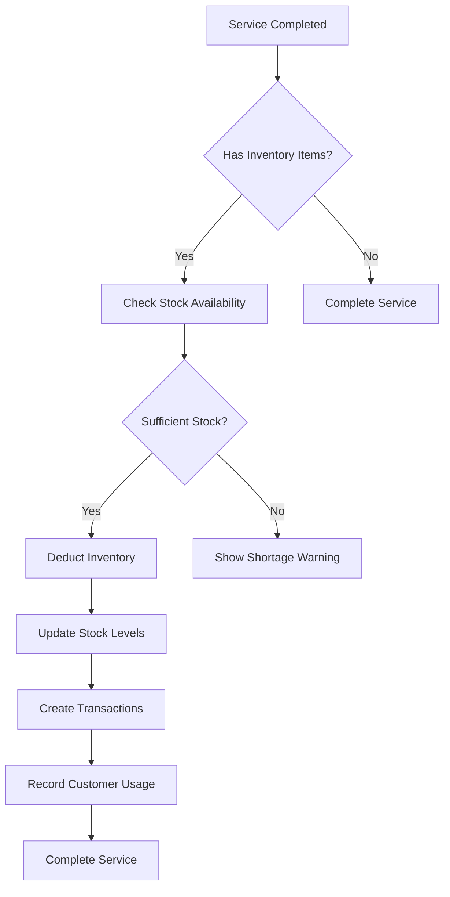

# Automatic Inventory Deduction & Customer Product Tracking

## Overview

This system now includes **automatic inventory deduction** and **comprehensive customer product tracking** to streamline salon operations and provide detailed insights into product usage patterns.

## 🚀 New Features

### 1. Automatic Inventory Deduction

When a service is completed, the system automatically:
- ✅ Checks inventory availability before completion
- ✅ Deducts used products from stock levels
- ✅ Creates detailed transaction records
- ✅ Prevents service completion if inventory is insufficient
- ✅ Generates professional receipts for all transactions

### 2. Customer Product History Tracking

Track every product used by each customer:
- 📊 **Overview Dashboard**: Summary statistics and insights
- 📝 **Usage History**: Detailed timeline of all products used
- 📈 **Analytics**: Product preferences, usage trends, and cost analysis
- 🎯 **Customer Insights**: Understand customer preferences and spending patterns

## 🗄️ Database Schema

### New Tables

#### `customer_product_usage`
```sql
CREATE TABLE public.customer_product_usage (
  id UUID PRIMARY KEY DEFAULT gen_random_uuid(),
  customer_id UUID REFERENCES public.customers(id) ON DELETE CASCADE NOT NULL,
  service_id UUID REFERENCES public.services(id) ON DELETE CASCADE NOT NULL,
  inventory_item_id UUID REFERENCES public.inventory_items(id) ON DELETE CASCADE NOT NULL,
  quantity_used INTEGER NOT NULL,
  unit_price DECIMAL(10,2) NOT NULL,
  total_cost DECIMAL(10,2) NOT NULL,
  used_at TIMESTAMP WITH TIME ZONE NOT NULL DEFAULT now(),
  created_by UUID REFERENCES auth.users(id) NOT NULL,
  created_at TIMESTAMP WITH TIME ZONE NOT NULL DEFAULT now()
);
```

### New Functions

#### `deduct_inventory_for_service(p_service_id UUID, p_created_by UUID)`
Automatically deducts inventory when a service is completed.

#### `check_service_inventory_availability(p_service_id UUID)`
Checks if a service has sufficient inventory before completion.

### New Triggers

#### `trigger_service_completion`
Automatically triggers inventory deduction when service status changes to 'completed'.

## 🔧 How It Works

### Service Completion Flow

1. **User clicks "Complete" on a service**
2. **System checks if service has inventory items**
   - If YES: Opens inventory availability check
   - If NO: Completes service directly
3. **Inventory availability check runs**
   - Validates stock levels for all required products
   - Shows detailed availability report
4. **If inventory is sufficient:**
   - Completes the service
   - Automatically deducts inventory
   - Records customer product usage
   - Creates inventory transactions
5. **If inventory is insufficient:**
   - Prevents service completion
   - Shows detailed shortage information
   - Prompts user to restock

### Inventory Deduction Process



## 🎯 User Interface

### 1. Inventory Availability Check

**Location**: Services page → Complete button → Inventory check dialog

**Features**:
- Real-time stock level validation
- Visual indicators for stock status
- Detailed shortage information
- Professional completion workflow

**Screenshots**:
- ✅ **Green**: All items available
- ⚠️ **Amber**: Some shortages detected
- ❌ **Red**: Critical shortages

### 2. Customer Product History

**Location**: Customers page → Product History tab

**Features**:
- **Overview**: Summary statistics and insights
- **Usage History**: Detailed timeline of products used
- **Analytics**: Product preferences and trends

## 📱 Usage Instructions

### For Service Completion

1. **Navigate to Services page**
2. **Find the service you want to complete**
3. **Click the "✓ Complete" button**
4. **If inventory items are used:**
   - Review inventory availability
   - Confirm all items are in stock
   - Click "Confirm & Complete Service"
5. **If no inventory items:**
   - Service completes immediately

### For Customer Product History

1. **Navigate to Customers page**
2. **Click on a customer to select them**
3. **Go to "Product History" tab**
4. **View comprehensive product usage data:**
   - Overview dashboard
   - Detailed usage history
   - Product analytics and trends

## 🔒 Security & Permissions

### Row Level Security (RLS)

- Users can only see product usage for their own services
- Admins have access to all customer product data
- Automatic audit trail for all inventory changes

### Data Integrity

- **Referential Integrity**: All foreign key relationships maintained
- **Transaction Safety**: Inventory deduction wrapped in database transactions
- **Audit Trail**: Complete history of all inventory movements

## 📊 Benefits

### For Salon Owners

- **Real-time Inventory Control**: Always know your stock levels
- **Automatic Cost Tracking**: Track product costs per service
- **Customer Insights**: Understand product preferences and usage patterns
- **Professional Workflow**: Streamlined service completion process

### For Staff

- **Easy Service Completion**: One-click completion with inventory validation
- **Clear Feedback**: Immediate visibility into stock availability
- **Professional Receipts**: Automatic receipt generation for customers

### For Customers

- **Transparency**: See exactly what products were used
- **Professional Service**: Automated inventory management
- **Detailed Records**: Complete history of all products used

## 🚨 Error Handling

### Inventory Shortages

- **Prevention**: Services cannot be completed with insufficient stock
- **Clear Messaging**: Detailed shortage information with specific quantities
- **Actionable Feedback**: Clear instructions on what needs to be restocked

### System Errors

- **Graceful Degradation**: System remains functional even with errors
- **User Feedback**: Clear error messages with retry options
- **Logging**: Comprehensive error logging for troubleshooting

## 🔄 Integration Points

### Existing Systems

- **Services**: Seamlessly integrated with service management
- **Inventory**: Real-time updates to stock levels
- **Customers**: Enhanced customer profiles with product history
- **Workers**: Commission calculations include product costs

### Future Enhancements

- **Barcode Scanning**: Quick product identification
- **Supplier Integration**: Automatic reorder suggestions
- **Customer Notifications**: Product usage summaries
- **Analytics Dashboard**: Advanced reporting and insights

## 📈 Performance Considerations

### Database Optimization

- **Indexed Queries**: Fast lookups for customer product history
- **Efficient Joins**: Optimized queries for complex data relationships
- **Background Processing**: Non-blocking inventory checks

### User Experience

- **Real-time Updates**: Immediate feedback on inventory status
- **Progressive Loading**: Smooth loading states and transitions
- **Responsive Design**: Works seamlessly on all devices

## 🧪 Testing

### Test Scenarios

1. **Service with sufficient inventory**
2. **Service with insufficient inventory**
3. **Service with no inventory items**
4. **Multiple products in single service**
5. **Customer with extensive product history**

### Validation Rules

- Stock levels cannot go negative
- All transactions must be recorded
- Customer usage must be tracked
- Service completion requires valid inventory

## 🚀 Getting Started

### 1. Run Database Migration

```bash
# Apply the new migration
supabase db push
```

### 2. Test the Features

1. **Create a service with inventory items**
2. **Try to complete the service**
3. **Verify inventory deduction**
4. **Check customer product history**

### 3. Monitor Performance

- Watch for any performance issues
- Monitor database query performance
- Check user feedback and adoption

## 📞 Support

### Common Issues

- **Inventory not deducting**: Check if service has inventory items
- **Permission errors**: Verify user has access to services
- **Performance issues**: Check database indexes and query optimization

### Troubleshooting

1. **Check browser console** for JavaScript errors
2. **Verify database permissions** for new functions
3. **Test with simple scenarios** first
4. **Check Supabase logs** for backend errors

## 🔮 Future Roadmap

### Phase 2 Features

- **Barcode Integration**: Scan products for quick identification
- **Advanced Analytics**: Machine learning insights
- **Customer Notifications**: Automated product summaries
- **Supplier Integration**: Automatic reordering

### Phase 3 Features

- **Multi-location Support**: Chain salon management
- **Advanced Reporting**: Executive dashboards
- **Mobile App**: Native mobile experience
- **API Integration**: Third-party system connections

---

**Last Updated**: January 2025  
**Version**: 1.0.0  
**Status**: Production Ready ✅

